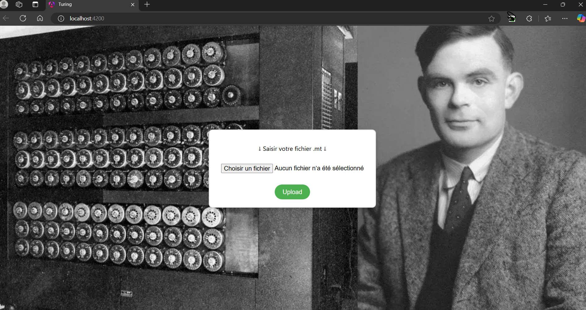
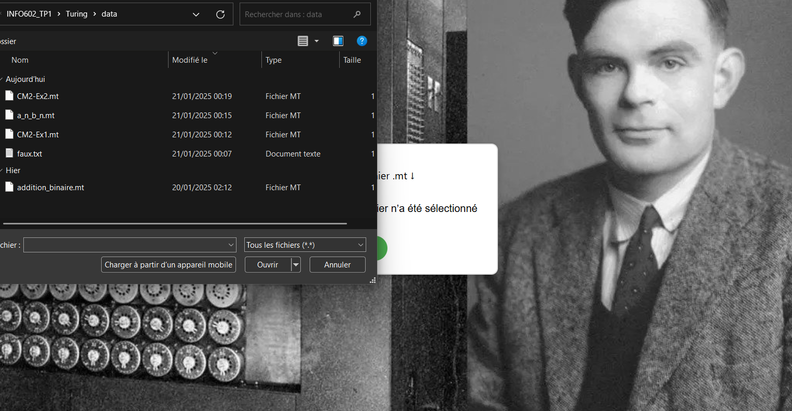
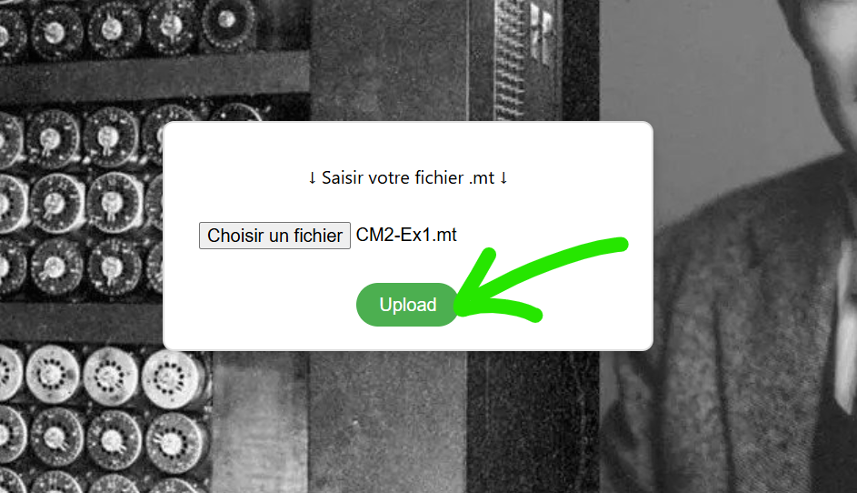
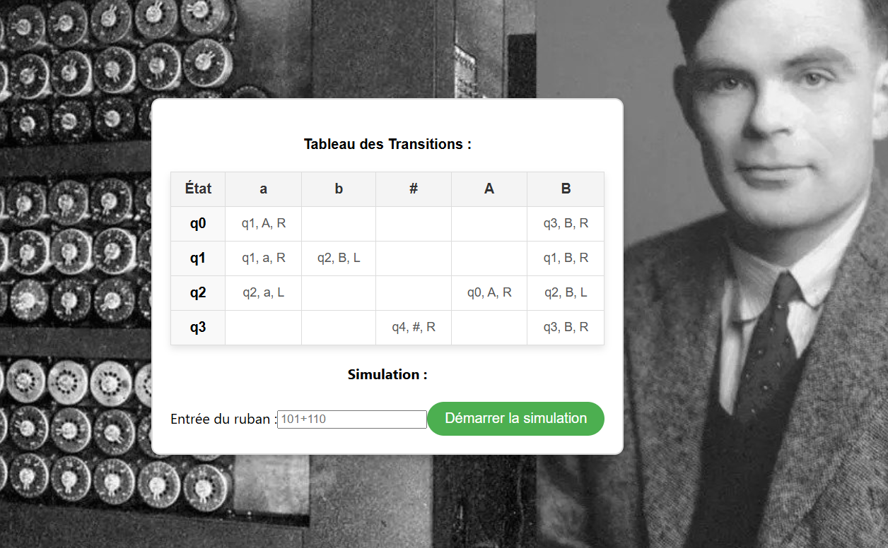
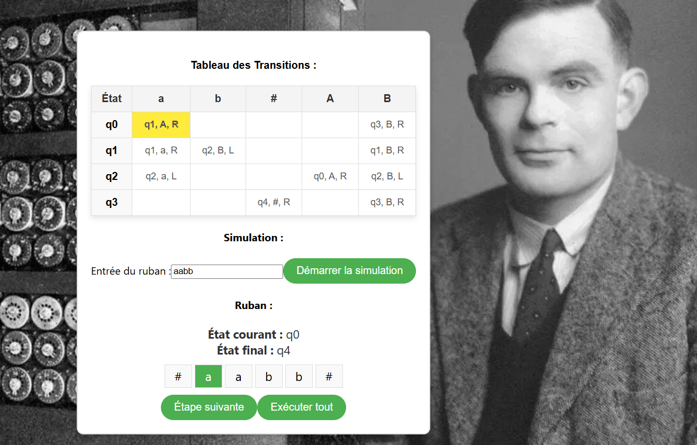
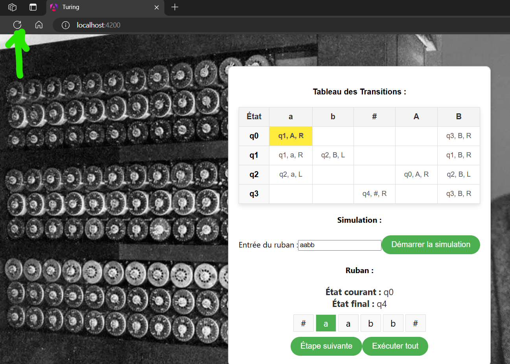

### Documentation du projet Turing
Ce document explique les différents fichiers du projet, leur rôle, et fournit également un guide d'installation pour configurer et exécuter l'application localement.

## **Structure des fichiers**
### 1. **`index.html` **
- Le fichier principal HTML qui sert de point d'entrée pour l'application Angular.
- Contient la balise `<app-root>`, utilisée pour injecter le composant principal de l'application.

### 2. **`DemoComponent` (dans un fichier TypeScript)**
- Le composant principal de l'application. Il gère :
    - Le téléchargement des fichiers `.mt`.
    - L'affichage des contenus des fichiers sous forme d'une machine de Turing interactive.
    - La logique principale de simulation des étapes de traitement de la machine.

- Points importants :
    - **Simulation des transitions** : Ce composant contient la logique pour exécuter les étapes d'une machine de Turing, en tenant compte des règles spécifiées dans le fichier `.mt`.
    - **Interface utilisateur :**
        - Téléchargement et affichage dynamique des transitions et du ruban.
        - Gestion de l'état de la tête de lecture de la machine.

### 3. **`styles.css` **
- Décrit les styles globaux de l'application.
- Points clés :
    - **Style global de la page** : Définit des polices, des marges, et utilize une image de fond inspirée d'Alan Turing.
    - **Ruban de la machine** : Stylise la visualisation du ruban et met en avant la position actuelle de la tête de lecture.
    - **Tableau des transitions** : Affichage interactif et lisible des transitions sous forme de tableau.

### 4. **`app.config.ts` & `app.module.ts`**
- Configuration de l'application Angular, gérant les modules importés, tels que `@angular/common` et `@angular/forms`.

### 5. **`README.md` **
- Fourni avec les instructions d'installation, de développement, de construction et de test de l'application (détaillé dans la prochaine section).

## **Guide d'installation**
### **Prérequis**
1. **Node.js** : Assurez-vous d'avoir Node.js (version LTS recommandée) installé. [Téléchargez ici](https://nodejs.org/en).
2. **Angular CLI** : Installez Angular CLI globalement. Vous verrez dans la partie des étapes pour configurer.

### **Étapes pour configurer et exécuter l'application**
1. **Cloner le dépôt** Téléchargez ou clonez le projet à partir du dépôt.
``` bash
   git clone https://github.com/Mathieu-Lin/INFO602_TP1.git
```
1. **Installation des dépendances** Naviguez dans le dossier du projet et installez les dépendances :
``` bash
   cd INFO602_TP1
   npm install
```

2. **Angular CLI** : Installez Angular CLI globalement.
``` bash
   npm install -g @angular/cli@19.1.2
```

1. **Démarrage du serveur de développement** Lancez le serveur avec Angular CLI :
``` bash
   cd ./Turing/src
   ng serve
```
Une fois démarré, ouvrez votre navigateur et accédez à l'application via :
```
   http://localhost:4200
```
1. **Tests unitaires** Si vous voulez exécuter les tests unitaires :
``` bash
   ng test
```
1. **Construction d'une version de production** Construisez une version optimisée pour la production avec cette commande :
``` bash
   ng build --prod
```
1. **Ajout de votre fichier `.mt`**
    - Une fois l'application ouverte dans votre navigateur, utilisez le champ de téléchargement pour importer un fichier `.mt`.
    - La simulation des étapes de la machine de Turing sera ensuite accessible via l'interface.

### **Format attendu pour le fichier `.mt`**
Le fichier `.mt` doit respecter une certaine structure pour être traité correctement par l'application. Voici un exemple général :
```
/** Transitions **/
etat1,symboleLu->etat2,symboleEcrit,Deplacement
etat1,symboleLu->etatFinal,symboleEcrit,Deplacement

/** Initial state **/
etatInitial

/** Final states **/
etatFinal

/** Tape alphabet **/
symbole1
symbole2

/** Blank symbol **/
#
```
- **Sections** :
    - `Transitions` : Contient les règles d'état de la machine (ex. : `etat,symboleLu->etatSuivant,symboleEcrit,Déplacement`).
    - `Initial state` et `Final states` : Définit les états de début et de fin.
    - `Tape alphabet` : Les symboles autorisés dans l'alphabet.
    - `Blank symbol` : Représente le symbole blanc (par défaut : `#`).


### **Notes supplémentaires**
1. **Outils externes** :
    - Le projet utilise Angular et peut être étendu ou intégré avec d'autres outils disponibles dans l'écosystème Angular.

2. **Ressources visuelles** :
    - L'interface inclut une image de fond inspirante et des composants dynamiques comme le ruban et le tableau des transitions.

3. **Guide supplémentaires**
    - Vous pouvez aller sur le dossier Turing pour voir un autre [README](./Turing/README.md)
    - Vous pouvez utiliser les fichiers .mt dans le dossier [data](./Turing/data)

## **Guide d'utilisation**
1. ** Commencement**

2. ** Saisie de votre fichier .mt**


3. ** Début de l'outil du simulation**

4. ** Vous pouvez simuler tranquillement**

5. ** Pour retourner, veuiller rafraichir la page **


## **IDE**

J'utilise IntelliJ IDEA Ultimate


## **Frameworks et autres**
- 
- 
- 
- 

## **Images**
- Lien du fond du site web : (https://fisheyeimmersive.com/wp-content/uploads/sites/2/2024/06/alan-turing-and-turing-machine.jpg)

## **Auteur**
Mathieu LIN L3 Informatique de l'Université Savoie Mont Blanc 2024-2025